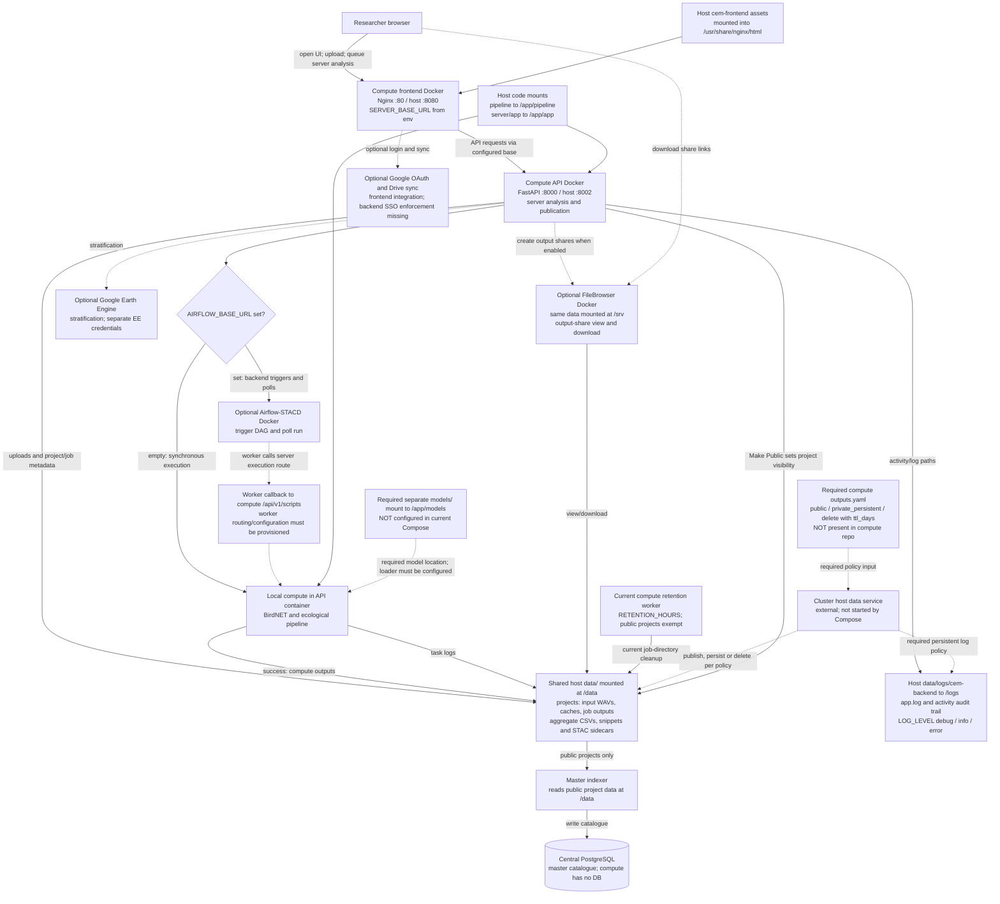

# cem-backend

The **compute** side of CEM: a FastAPI server that runs BirdNET and the
ecological analysis pipeline over uploaded audio, and publishes finished
projects for the public catalogue.

This repo owns the compute API and frontend. FileBrowser is optional.

## Architecture Diagram

This diagram shows current execution and storage, with unmet cluster requirements
marked **required, not configured**. Solid arrows show current paths; dotted
arrows show optional integrations or required changes. `AIRFLOW_BASE_URL` is the
current switch; the checklist calls it `AIRFLOW_API_BASE` (not supported yet).



The browser calls the compute API, which handles Airflow dispatch and polling;
it does not need direct Airflow access for server analysis. Local execution does
not require an Airflow host. On the current Airflow path, the worker calls the
compute execution endpoint; worker/callback connectivity must be configured on
the cluster, and no `CORESTACK_API_BASE` setting is currently exposed here.

A local browser watcher is a separate execution option: it reads browser-selected
project files and writes local results. These files are not automatically the
server's shared data and are not sufficient for server publication.

The model node is a required change, not an existing mount. Master has no model
weights; compute uses BirdNET loaders, whose model paths must be configured when
introducing that mount. API request and job diagnostics are written to stdout and persistent
`data/logs/cem-backend/app.log`, selected by `LOG_LEVEL=debug|info|error`.
Compute currently uses its own retention worker; full checklist compliance needs
a compute policy file and host-managed enforcement. Separate compute UI/API
containers also remain a checklist gap. External GEE and Drive services are
optional; no GeoServer or object-storage integration is configured in this flow.

## Local setup links

- [Local setup guide](https://github.com/err400/cem-master-backend/blob/main/docs/local-setup.md)
- [Full setup and environment guide](https://github.com/err400/cem-master-backend/blob/main/CEM_SETUP_GUIDE.md)


## Setup and deployment

For a fresh installation, follow the
[complete setup guide](https://github.com/err400/cem-master-backend/blob/main/CEM_SETUP_GUIDE.md).
It covers all four repositories, environment roles, private credential generation,
shared-data mounts, database migrations, and production proxy configuration.
The deployment folder name is `cem-backend`.

Compute UI: https://www.cse.iitd.ernet.in/act4dws5/bio/

Set `ALLOWED_ORIGINS=https://www.cse.iitd.ernet.in` and configure `SERVER_BASE_URL`
to the confirmed public compute API base. The UI URL alone does not identify the
backend proxy route. Example credentials in `.env.example` are not production
credentials; keep actual passwords in private `.env` files.

## Compute-only local start


Clone the two compute repos **side by side** — compose builds the frontend from
`../cem-frontend`:

```text
your-workspace/
├── cem-backend/      <- you are here
└── cem-frontend/
```

```bash
test -f .env || cp .env.example .env
mkdir -p data/projects logs
docker compose config --quiet
docker compose up -d --build api frontend
curl --fail localhost:8002/health          # {"status":"ok", ...}
```

| | |
| --- | --- |
| Compute page | <http://localhost:8080> |
| API docs | <http://localhost:8002/docs> |
| FileBrowser (only when enabled) | <http://localhost:8097> |

`./pipeline` and `./server/app` are bind-mounted, so editing a script needs
`docker compose restart api`, not a rebuild. Rebuild when the Dockerfile or either `requirements.txt` or
`server/requirements-server.txt` changes.

> The frontend used to live in `cem-frontend/docker-compose.yml`. That file was
> removed: two compose files meant two ways to start one system, and they
> drifted. One repo owns each service now.

## Log Levels and API Requests

Set `LOG_LEVEL` in the compute backend `.env`; Compose passes it to API/pipeline
and frontend. `DEBUG=true` remains a legacy override; otherwise use `DEBUG=false`.

| Level | Description |
|---|---|
| `debug` | Detailed request/upload/pipeline traces and browser diagnostics, plus normal events and failures |
| `info` | Default: startup, completed API request summaries, job starts/results and failures |
| `error` | Failed HTTP requests (4xx/5xx), unhandled exception types and job failures |

API summaries include method, route template, status, elapsed milliseconds and a
request ID, without headers, query strings or bodies. The API middleware runs at
all levels and preserves streaming responses. Browser traces are enabled only
at debug. Application logs persist at `data/logs/cem-backend/app.log` by default;
`HOST_LOG_DIR` can override that host location. Pipeline/audit/third-party logs
have separate behavior. See the
[logging guide](https://github.com/err400/cem-backend/blob/master/DEBUGGING.md).

```bash
# From the compute backend checkout, after editing .env:
docker compose up -d api frontend
docker compose logs -f api
tail -f data/logs/cem-backend/app.log
```

## Configuration

`.env` is read automatically by Compose.

| Variable | Default | Meaning |
| --- | --- | --- |
| `CEM_DATA_DIR_HOST` | `./data` | Where projects, audio and results live |
| `ALLOWED_ORIGINS` | `*` | CORS. Narrow this in anything public |
| `COMPUTE_BACKEND_PORT` | `8002` | Host port for the API |
| `COMPUTE_FRONTEND_PORT` | `8080` | Host port for the page |
| `SERVER_BASE_URL` | `http://localhost:8002` | API address **as the browser sees it** |
| `GOOGLE_CLIENT_ID` | *(blank)* | Blank disables Drive features only |
| `BIRDNET_MAX_WORKERS` | `2` | Each worker loads its own TensorFlow model |
| `RETENTION_HOURS` | `168` | Job-folder sweep. `0` disables. Public projects are exempt |
| `FILEBROWSER_BASE_URL` | *(blank)* | Blank = no share links. See below |

`js/core/Config.js` is generated **inside the frontend container at startup**
from `SERVER_BASE_URL` and friends — you no longer run `generate_config.sh` by
hand. A blank `GOOGLE_CLIENT_ID` is fine: `App.js` logs *"Drive features
disabled"* and carries on, and the API has no authentication of its own.

## Two rules that fail silently

These cost real debugging time. Neither produces an error.

**1. Filenames must follow the Song Meter convention.**

```
SPOT_YYYYMMDD_HHMMSS.wav       e.g. 04213SPOT1_20260131_082409.wav
```

`pipeline/file_metadata.py` returns `None` for anything else, and
`birdnet_predictions.py`'s date filter then drops the file **without a
message**. A folder of `REC001.wav` gives you an empty run that looks exactly
like BirdNET finding nothing.

**2. Dates on the API are `YYYYMMDD`, not ISO.**

`projects.py` filters uploads with a plain string comparison against
`_parse_date_from_filename`, which yields `"20260131"`:

```python
if end_date and fd > end_date: continue
```

Send `"2026-01-31"` and every file is skipped — `'0'` is `0x30`, `'-'` is
`0x2D`, so the compact form sorts *after* the ISO one. You get a 409 saying no
audio matches the range, for audio sitting right there on disk. The frontend
avoids this with `startDate.replace(/-/g, '')`; nothing server-side validates
the format, so any other client repeats the mistake.

## Typical flow

```text
POST /api/v1/projects/upload/audio     project, spot, files
POST /api/v1/analyze                   script=birdnet, job_id, spots, spots_geo,
                                       start_date/end_date as YYYYMMDD
POST /api/v1/projects/publish          project        ← "Make public"
```

`/analyze` is **synchronous** when Airflow is not configured: the HTTP call
blocks for the whole run and the response carries the result. Runtime depends on recording duration, worker count and server resources;
configure proxy timeouts for the selected execution mode.

`spots_geo` (`[{"name", "lat", "lon"}]`) is the **only** place coordinates ever
reach disk, as `<job>/input/geo.json`. A spot analysed without it can never be
placed on the master map.

`publish` refuses with **409** unless there is a completed server-side BirdNET
job *and* `dataset/aggregate.csv`. That guard is deliberate: a project with no
detections has nothing to publish. Publishing sets `visibility=public` and
`retention_hours=None`, exempting it from the sweeper — the master catalogue
must not point at files that expire.

Re-running a step with identical parameters returns the previous successful task
rather than re-running it, and `processed_files.txt` means already-analysed
audio is skipped. Use a new project name if you want to watch BirdNET work.

## FileBrowser (download links)

`runner.py` creates a public share for each step's output directory and records
the hash in `job.json`. The master indexer reads those hashes and turns them into
download links on the public page. It never creates or revokes one.

Off by default. Configure access controls and private credentials before starting
`filebrowser` with `docker compose up -d filebrowser`. Its current port mapping
exposes port 8097 on all host interfaces. To enable share creation:

```dotenv
FILEBROWSER_BASE_URL=http://filebrowser:80
FILEBROWSER_PASSWORD=REPLACE_WITH_PRIVATE_PASSWORD
```

Recent FileBrowser images generate an initial password on first startup.
Retrieve it privately from the service logs or configure a known password using
the installed FileBrowser administration tools. Set the matching value only in
private `.env`; do not paste credential-bearing logs into documentation.

Three things to know before enabling this on real data:

1. Shares are created at **analysis** time, for private projects too. Only
   project visibility keeps them out of the catalogue; the share itself exists,
   and anyone holding the hash can read it.
2. `mark_private()` sets `retention_hours=168`, so a link stays live for up to
   7 days after unpublishing while the catalogue rows vanish in ~30s. Unpublish
   should revoke shares.
3. FileBrowser's UI on `:8097` is a separate surface and must not be publicly
   reachable as shipped.

`share_dir` is `work/` for birdnet and `results/<step>/` for everything else —
birdnet writes its real outputs to `work/` and leaves only `_run.log` in
`results/birdnet/`.

## Earth Engine (optional, stratification only)

Separate credentials from anything above. On the **host**:

```bash
pip install earthengine-api && earthengine authenticate
```

Then in `.env` — an absolute path, because `~` does not expand in a volume mount:

```dotenv
GEE_PROJECT=YOUR_AUTHORIZED_PROJECT
EARTHENGINE_CREDENTIALS=/absolute/path/to/.config/earthengine
```

```bash
docker compose up -d
docker compose exec api ls -l /root/.config/earthengine
```

Leave `GEE_SERVICE_ACCOUNT*` blank; that is a separate path for unattended
accounts.

## The local watcher (optional)

The other way to run analysis: a Python daemon on the researcher's own machine,
using the local filesystem as the queue instead of the network. Useful for
running BirdNET locally without uploading audio anywhere.

From a folder the app has local storage access to (the UI copies `watcher.py`
there):

```bash
python watcher.py
```

First run builds a venv under `system/.venv` and installs numpy, pandas,
librosa, tensorflow-cpu and birdnetlib — several minutes, and it needs outbound
access to PyPI and `raw.githubusercontent.com/xHrid/cem-backend`, from which it
pulls the pipeline scripts (tracking `master`).

The UI's indicator reads a heartbeat file. *Stale/offline* means either it is
not running or it is busy on something slower than the poll interval — a
first-time install looks exactly like this.

## Troubleshooting

| Symptom | Cause | Fix |
| --- | --- | --- |
| 409 "no audio files ... for the selected date range" | `start_date` sent as ISO, or filenames off-convention | Send `YYYYMMDD`; rename to `SPOT_YYYYMMDD_HHMMSS.wav` |
| BirdNET runs, finds nothing | Same as above — files silently filtered out | Check `GET /api/v1/jobs/{id}/results` |
| 409 on publish | No completed BirdNET job, or no `aggregate.csv` | The guard is correct; check the run first |
| CORS error in the browser console | `ALLOWED_ORIGINS` excludes the frontend origin | Exact scheme+host+port, no trailing slash |
| Sign-in/Drive does nothing | Blank `GOOGLE_CLIENT_ID` | Expected. Server-compute mode is unaffected |
| Share links never appear | `FILEBROWSER_BASE_URL` blank, or wrong password | See above. Failures are best-effort and only warn in the job log |
| Spot missing from the master map | Project not public, or no `spots_geo` | `grep visibility data/projects/<p>/project.json` |
| `BrokenProcessPool` | Memory — each worker loads its own TF model | Lower `BIRDNET_MAX_WORKERS` |
| Watcher: "another instance is already running" | Stale lock from a crash | Delete `system/watcher.lock` |
| Watcher: `ImportError: DLL load failed ... Application Control policy` | Managed Windows blocking `numba` | Machine policy, not a bug — ask IT to allow it |

## Layout

```
pipeline/          analysis scripts — single source of truth; the watcher pulls these too
server/app/        FastAPI: stacd_api (all routes), runner, jobs, projects,
                   retention, filebrowser_client, safepath
data/              DATA_DIR — projects/<name>/{<spot>/audio, dataset, <script>/<job>}
Dockerfile         CPU by default; build args switch to CUDA
```

## Related

- [cem-frontend](https://github.com/err400/cem-frontend) — the compute page this compose file starts
- [cem-master-backend](https://github.com/err400/cem-master-backend) — indexes public projects from `DATA_DIR`
- [cem-master-frontend](https://github.com/err400/cem-master-frontend) — the public map
